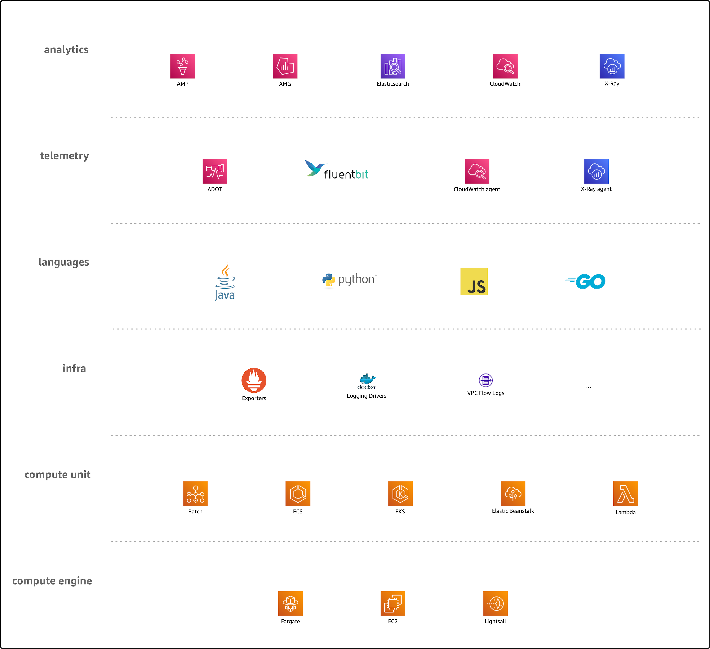

# Dimensions

In the context of this site we consider the o11y space along six dimensions.
Looking at each dimension independently is beneficial from an synthetic
point-of-view, that is, when you're trying to build out a concrete o11y solution
for a given workload, spanning developer-related aspects such as the programming
language used as well as operational topics, for example the runtime environment
like containers or Lambda functions.

!!! question "What is a signal?"
    When we say signal here we mean any kinds of o11y data and metadata points,
    including log entries, metrics, and traces. Unless we want to or have to be
    more specific, we use "signal" and it should be clear from the context what
    restrictions may apply.

Let's now have a look at each of the six dimensions one by one:

## Analytics

An umbrella term for all kinds of signal destinations including long term
storage and graphical interfaces that let you consume signals. As a developer,
you want access to an UI or an API that allows you to discover, look up, and
correlate signals to troubleshoot your service. In an infrastructure or platform
role you want access to an UI or an API that allows you to manage, discover,
look up, and correlate signals to understand the state of the infrastructure.

Ultimately, this is the most interesting dimension from a human point of view.
However, in order to be able to reap the benefits we first have to invest a bit
of work: we need to instrument our software and external dependencies and ingest
the signals into the destinations.

So, how do the signals arrive in the destinations? Glad you asked, it's …

## Telemetry

How the signals are collected and routed. The signals can come from two sources:
either your application source code, see [language](#language) section, or 
from stuff your app depends on, such as state managed in datastores or databases
as well as infrastructure like VPCs, as discussed
in [infra & persistent data](#infra-persistent-data).

[Learn more about telemetry …](../telemetry)

## Language

This dimension is concerned with the programming language you use for writing
your service or application. Here, we're dealing with SDKs and libraries, such 
as the [X-Ray SDKs][x-ray-sdks] or what OpenTelemetry provides in the context
of [instrumentation][otel-instrumentation].

## Infra & persistent data

Any sort of application-external dependencies, be it infrastructure like 
a VPC or a datastore like RDS or DynamoDB or a queue like SQS. This includes
but is not limited to the following:

- AWS infrastructure, for example [VPC flow logs][vpc-flow-logs].
- Secondary APIs such as [Kubernetes API logs][k8s-api-logs].
- Signals from datastores and databases, such as or
  [S3 bucket access logs][s3-bucket-logs] or traces from RDS.

!!! tip "Commonalities"
    One thing all the sources in the "Infrak & Persistent Data" dimension have
    in common is that they are located outside of your application (as well
    as the compute environment your app runs in) and with that you have to treat
    them as an opaque box.

## Compute unit

The way your code is packagedm, scheduled, and run. For example, in Lambda that's a
function and in ECS and EKS that's a container (and tasks and pods
respectively).

## Compute engine

This refers to the base runtime environment, which may (EC2 instance, for
example) or may not (Fargate, Lambda) be your responsibility to maintain.

[vpc-flow-logs]: https://docs.aws.amazon.com/vpc/latest/userguide/flow-logs.html
[s3-bucket-logs]: https://docs.aws.amazon.com/AmazonS3/latest/userguide/enable-server-access-logging.html
[k8s-api-logs]: https://docs.aws.amazon.com/eks/latest/userguide/control-plane-logs.html
[x-ray-sdks]: https://docs.aws.amazon.com/xray/index.html
[otel-instrumentation]: https://opentelemetry.io/docs/concepts/instrumenting/
