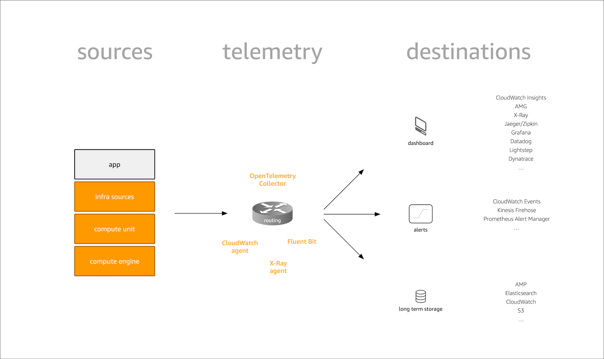

# Telemetry

Telemetry is all about how the signals are collected from various sources,
including your own app and infrastructure and routed to destinations where
they are consumed:

Let's further dive into the concepts introduced in above figure.

## Sources

Where signals come from.

Two types: under your control (application source code, instrumentation), and
the ones provided by AWS via an API.

## Routers and Agents

Where signals shoud go, optional filtering and aggregation.

!!! note "Routing? Shipping?"
    There are many terms out there people use to refer to the process of
    getting the signals from sources to destinations including routing,
    shipping, aggregation, etc. and we will treat them here interchangeably.

## Destinations

Where signals end up, for consumption. 
